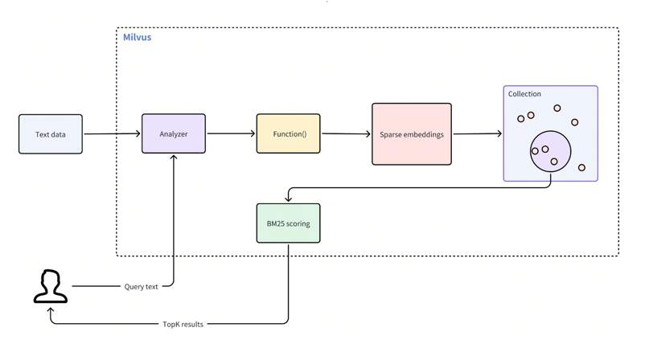

## 文本自动构建向量的搜索方式


与基于语义的密集向量搜索相结合,无需手动生成向量数据，从而简化了基于文本的搜索过程。此功能通过以下工作流程运行：

1. **文本输入**：您插入原始文本文档或提供查询文本，无需手动Embedding
2. **文本分析**：Milvus 使用分析器将输入文本标记为单独的可搜索术语。
3. **函数处理**：内置函数接收标记化术语并将其转换为稀疏向量表示。
4. **集合存储**：Milvus 将这些稀疏嵌入存储在集合中，以便高效检索。
5. **BM25 评分**：在搜索过程中，Milvus 应用 BM25 算法为存储的文档计算分数，并根据与查询文本的相关性对匹配结果进行排名。

<div style="display: inline-block; border: 4px solid #ccc; border-radius: 10px; box-shadow: 0 4px 8px rgba(0, 0, 0, 0.1); margin: 10px; padding: 10px;">
  
</div>

### 示例

在实体类中添加 `AnalyzerParams` 注解：

```java
import org.dromara.milvus.plus.annotation.*;

public class TextEntity {

    @MilvusField(
            name = "text",
            dataType = DataType.VarChar,
            enableAnalyzer = true,
            analyzerParams = @AnalyzerParams(
                    type= AnalyzerType.CHINESE
            )
//            analyzerParams = @AnalyzerParams(
//            tokenizer= "standard",
//            filter=@Filter(
//                    builtInFilters={
//                            BuiltInFilterType.lowercase
//                    },
//                    customFilters = {
//                            @CustomFilter(
//                                    type = "length",
//                                    max = 40
//                            ),
//                            @CustomFilter(
//                                    type = "stop",
//                                    stopWords = {"of","to"}
//                            )
//                    }
//            )
//            )
    )
    private String text; 
}
```
非专业人员不要设置 analyzerParams，只需设置 enableAnalyzer = true即可。

## 分析仪的使用

- 使用type指定内置分析仪
- 自定义分析仪，需配置分词器和过滤器

### 默认分析仪（Type）

- **默认分析仪**：可以根据 AnalyzerType 接口中的常量来设置具体的分词器类型

### 分词器（Tokenizer）

- **默认分词器**：`standard` 分词器，基于语法规则将文本拆分为离散的单词单元。
- **注解属性**：在 `AnalyzerParams` 注解中使用 `tokenizer` 属性来配置分词器。如果未指定，则默认为空字符串

### 过滤器（Filter）

- **默认过滤器**：`lowercase` 过滤器，将所有标记转换为小写，以支持不区分大小写的搜索。
- **注解属性**：在 `Filter` 注解中使用 `builtInFilters` 和 `customFilters` 属性来配置内置过滤器和自定义过滤器。`builtInFilters` 属性接受 `BuiltInFilterType` 枚举值的数组，而 `customFilters` 属性接受 `CustomFilter` 注解的数组。

### 自定义停用词（StopWords）

- **可选参数**：`stop_words`，用于指定要从分词结果中排除的停用词列表。
- **注解属性**：在 `CustomFilter` 注解中使用 `stopWords` 属性来定义自定义停用词。


### 内部处理

MilvusPlus内部会基于该注解，实现以下步骤

- 生成存储文本对应Embedding存储的字段

- 定义一个函数将文本转换为稀疏向量的函数

- 创建该字段的索引


### 使用

```
MilvusResp<List<MilvusResult<Face>>> xx = mapper
        .queryWrapper()
        .textVector(Face::getText, "whats the focus of information retrieval?")
        .topK(2)
        .query();
```