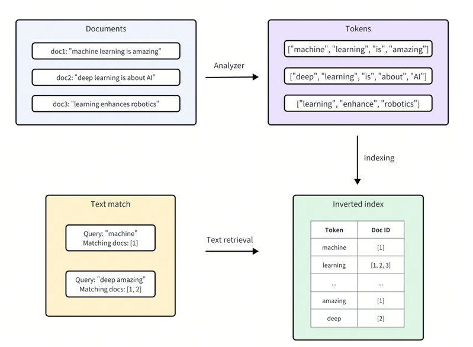

### 文本匹配的搜索方式

Milvus 集成了Tantivy来支持其底层倒排索引和基于术语的文本搜索。对于每个文本条目，Milvus 按照以下步骤对其进行索引：

- 分析器: 分析器将输入文本标记为单个单词或标记，然后根据需要应用过滤器。这允许 Milvus 根据这些标记构建索引。
- 索引: 在文本分析之后，Milvus 会创建一个倒排索引，将每个唯一的标记映射到包含它的文档。


<div style="display: inline-block; border: 4px solid #ccc; border-radius: 10px; box-shadow: 0 4px 8px rgba(0, 0, 0, 0.1); margin: 10px; padding: 10px;">
  
</div>

### 示例
请将`enableAnalyzer`和`enableMatch`参数都设置为True。
这将指示 Milvus 对文本进行标记并为指定字段创建倒排索引，从而实现快速高效的文本匹配。

```java
import org.dromara.milvus.plus.annotation.*;

public class TextEntity {

    @MilvusField(
            name = "text",
            dataType = DataType.VarChar,
            enableAnalyzer = true,
            enableMatch = true
    )
    private String text; 
}
```
### 使用文本匹配进行搜索

文本匹配可以与向量相似性搜索结合使用，以缩小搜索范围并提高搜索性能。通过在向量相似性搜索之前使用文本匹配过滤集合，可以减少需要搜索的文档数量，从而缩短查询时间。

```java

MilvusResp<List<MilvusResult<Face>>> xx = mapper
        .queryWrapper()
        .textVector(Face::getText, "whats the focus of information retrieval?")
        .textMatch(Face::getText,"retrieval")
        .textMatch(Face::getText,"information")
        .topK(2)
        .query();

```

